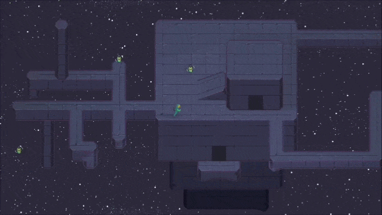
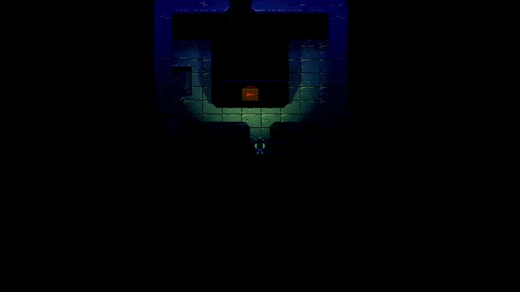
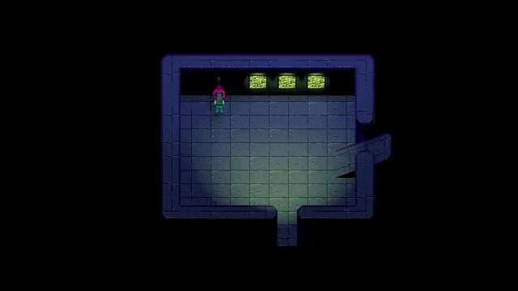
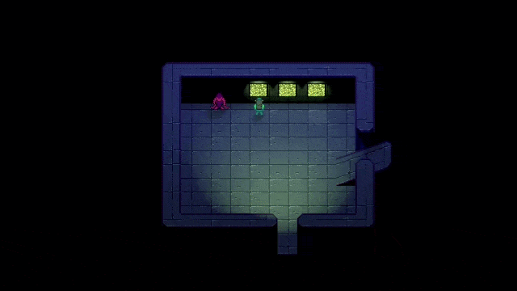
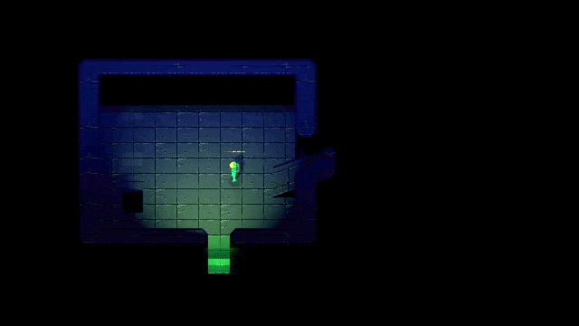
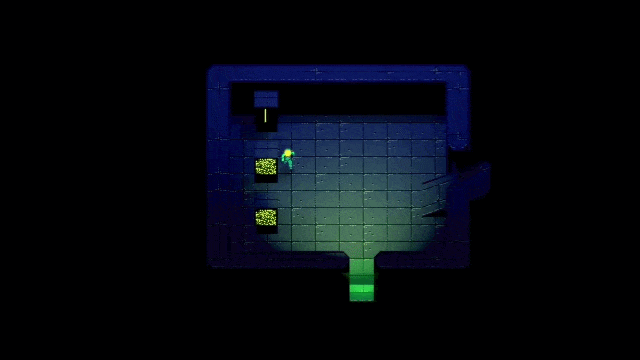
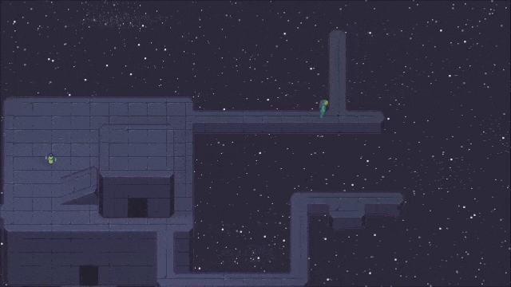
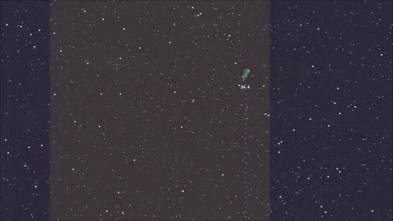
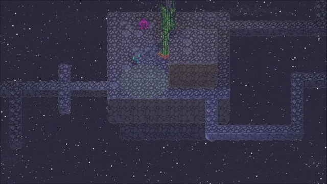

# Gogot game development
I'm currently working on my first indie game in Godot.
Here are some GIF gameplay samples from the recent build.

*Your're an astronaut on a strange journey*  
  
*solving puzzles*  
  
*meeting alien creatures*  
  
*solving more puzzles*  
  
*forcing barriers*  
  
*finding your way out*  
  
*dashing through the stars*  
  
*sightseeing in zero g*  
  
*casually air walking ???*  
  
*exploring new places*  
  
*finding allies*  
  
*admiring foliage and stargazing*  
  
