# Pulse Afar game development
Since April 2026 I'm working on my first indie game Pulse Afar.

Pulse Afar is a 2D exploration adventure set in a distant world.
The player will encounter unusual creatures, clever puzzles and tricky platforming.

Here are some YT videos to check the progress:

[https://youtu.be/N4UYv_dB7RQ](https://youtu.be/N4UYv_dB7RQ)

[https://youtu.be/zK68x3POjIE](https://youtu.be/zK68x3POjIE)

Below you can watch short gameplay samples from the recent build.

  
  
  
  
  
  
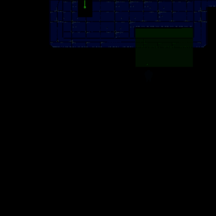  
  
  

Here are some recent screenshots from when I captured them instead of playing:

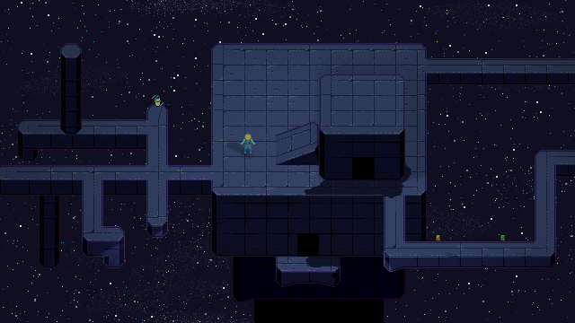  

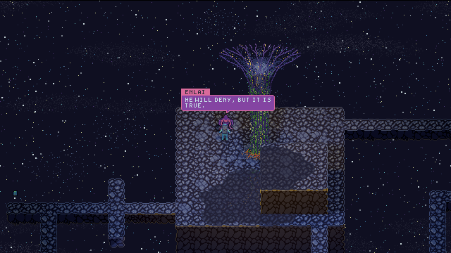  

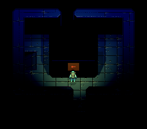  

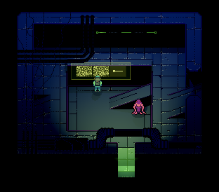  

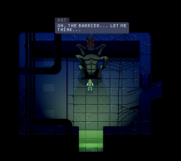  

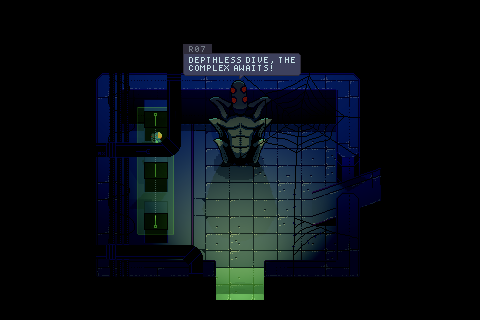  

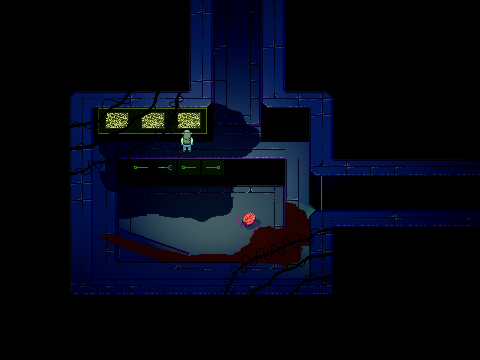  

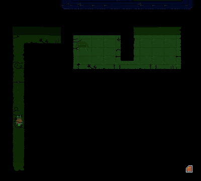  

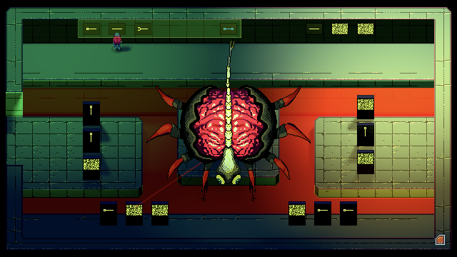  

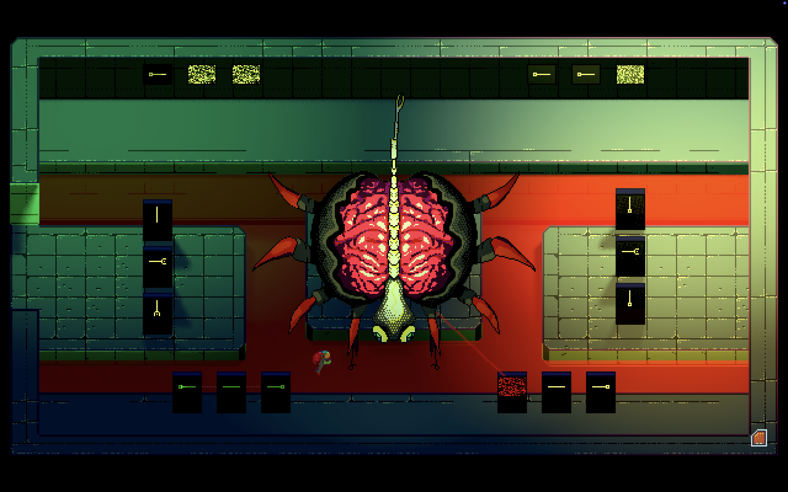  
